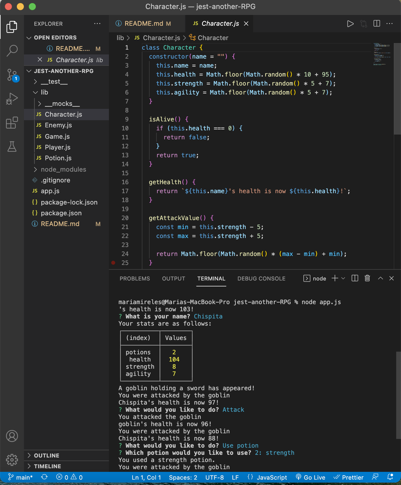

# jest-another-RPG

## Description
Jest-Another-RPG is a back-end / command-line role-playing game. The app allows the user to fight a few enemies. Then, the enemies health and stats can be sustained by a potion. The app is built using Object-oriented programming and Test-driven development. 

## Table of Contents (Optional)

If your README is very long, add a table of contents to make it easy for users to find what they need.

* [Installation](#installation)
* [Usage](#usage)
* [License](#license)
* [Credits](#credits)

## Installation

* run `npm i`

## Usage 

To use the app:
1. Open the terminal 
2. Run `node app.js`
3. Answer prompt questions

---

🏆 
## Badges

## Contributing / Credits

[mariamv29](https://github.com/mariamv29/README-generator.git)
